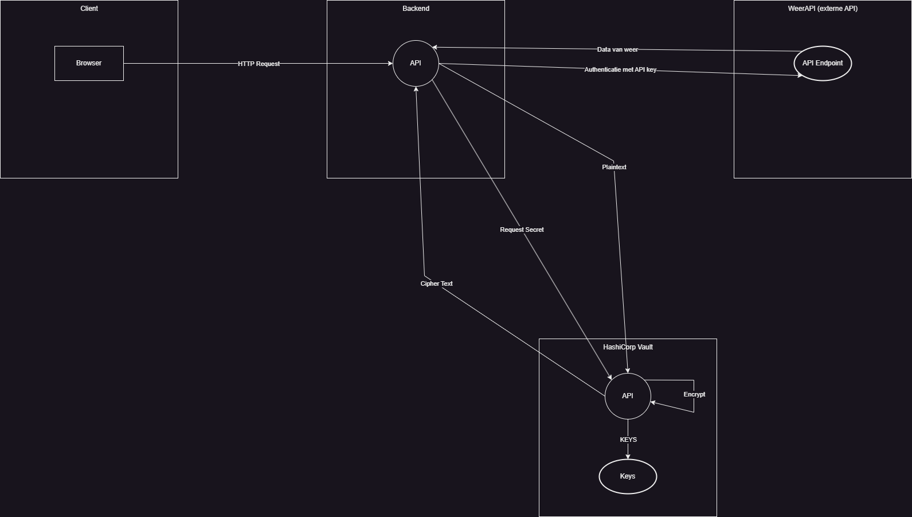

# Verslag labo5
 
In dit labo heb ik gewerkt met 2 services deze zijn:
1. Vault
    - Ik gebruik de vault image van docker.
2. Python application
    - Een zelf geschreven python application, deze gebruikt flask als webserver en hvac voor de communicatie voor vault.

## Vault installatie

Stap 1: Omgevingsvariabele instellen

```
export VAULT_TOKEN=dev-token
```

Stap 2: Key-Value Engine

```
docker exec -e VAULT_TOKEN=dev-token vault_server vault secrets enable -path=secret kv

docker exec -e VAULT_TOKEN=dev-token vault_server vault kv put secret/weather_api apikey="WEATHER_APP_API"
```

Stap 3: Transit Engine

```
docker exec -e VAULT_TOKEN=dev-token vault_server vault secrets enable transit

docker exec -e VAULT_TOKEN=dev-token vault_server vault write -f transit/keys/container-key
```

Functionaliteiten:
- Get information: Haalt de API-key realtime uit Vault en doet een GET naar OpenWeatherMap
- Encrypt: Stuurt plaintext naar Vault en ontvangt cyphertext terug

## Vraag in PDF / models

| ID | Categorie | Dreiging (Threat) | Status | Hoe dit is opgelost in mijn opdracht |
|:---:|---|---|:---:|---|
| **1** | Spoofing | Secret is stolen from plaintext files or environment variables | **Opgelost** | De OpenWeatherMap-key staat niet in `app.py` of `Dockerfile`, maar is opgeslagen in de **KV Store** van Vault. De code haalt deze pas op tijdens uitvoering ("Runtime fetch"). |
| **2** | Spoofing | Secret is guessed after a long time (due to not being rotated) | **Opgelost** | Omdat de applicatie de sleutel bij elk verzoek opnieuw ophaalt, kan ik de API-key in Vault wijzigen (roteren) zonder de applicatie te stoppen. Dit maakt frequente rotatie mogelijk. |
| **3** | Tampering | Secret is changed by unauthorized people | **Opgelost** | In plaats van een tekstbestand dat iedereen kan bewerken, beveiligt Vault de geheimen. Alleen gebruikers met een geldig token en de juiste rechten kunnen de data in Vault wijzigen. |
| **4** | Repudiation | Secret is accessed without an audit trail | **Opgelost** | Vault biedt de mogelijkheid om 'audit logging' in te schakelen. Hiermee wordt elke toegang tot het geheim geregistreerd, in tegenstelling tot het onzichtbaar lezen van een lokaal bestand. |
| **7** | Denial of Service | Secret expires (and this leads to a widespread outage) | **Opgelost** | Door centraal beheer in Vault heb ik een overzicht van mijn geheimen. Vault kan (in geavanceerde setups) sleutels automatisch vernieuwen of waarschuwen voordat ze verlopen, wat plotselinge uitval voorkomt. |
| **8** | Elevation of Privilege | Secret has overly broad permissions attached to it | **Deels Opgelost** | Voor deze opdracht gebruik ik het `dev-token` (Root). Dit token heeft technisch gezien alle rechten. In een productie-omgeving zou ik dit dichtzetten door een policy aan te maken die alleen 'read'-rechten geeft op de weer-key. |

## Threat Model

